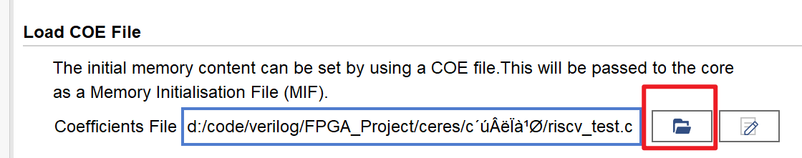

## 如何使用ceres进行综合测试

### 配置环境变量

1. 找到riscvgcc文件夹下bin文件夹的地址


2. 找到系统环境变量

   

   3. 新建环境变量的地址

   

   4.  复制地址

      

### 利用riscvgcc编译生成

**编译过程可分为4步，分别是**：

1. 调用 `riscv-none-embed-gcc`将c语言编译为`elf`文件

2. 调用 `riscv-none-embed-objdump`生成反汇编`asm`文件

3. 调用`riscv-none-embed-objcopy` 生成含有RISC-V指令的二进制`bin`文件

4. 使用自行编写的c语言脚本，将二进制`bin`文件转化为文本类型的`coe`文件

   

> 实际使用时，只需要修改c代码相关文件夹中的`riscv_test.c`文件来编写代码，
>
> **再运行脚本`一键编译生成coe文件.bat`即可得到coe文件**

 

### 利用反汇编文件与coe文件配置RISC-V内核

通过`riscvgcc`得到反汇编代码如下：

    ```assembly
    00010054 <main>:
    int main()
    {
       10054:	ff410113          	addi	sp,sp,-12
       10058:	00812423          	sw	s0,8(sp)
       1005c:	00c10413          	addi	s0,sp,12
        int i = 0, ans = 0;
       10060:	fe042c23          	sw	zero,-8(s0)
       10064:	fe042a23          	sw	zero,-12(s0)
        for (i = 0; i < 10; i++)
       10068:	fe042c23          	sw	zero,-8(s0)
       1006c:	0200006f          	j	1008c <main+0x38>
      ( 此处省略若干行)
        return 0;
       10098:	00000793          	li	a5,0
       1009c:	00078513          	mv	a0,a5
       100a0:	00812403          	lw	s0,8(sp)
       100a4:	00c10113          	addi	sp,sp,12
       100a8:	00008067          	ret
    
    ```

1. 从中可以得知PC指针的起始地址应为0x00010054（这个值可能会随着c代码变量的个数而改变）。由此，更新在`core_param.v`文件中的宏定义`PC_START_ADDR`。

   。

2. 另外特别需要注意的是，寄存器中的`sp`寄存器（`x2`）和`s0`寄存器（`x8`）的值需要被初始化为main函数的入口地址，即`PC_START_ADDR`，其余寄存器为0即可（此部分已在内核中配置）。

再将生成的coe文件放入IP核的初始化文件，并且重新预综合，并运行仿真。




